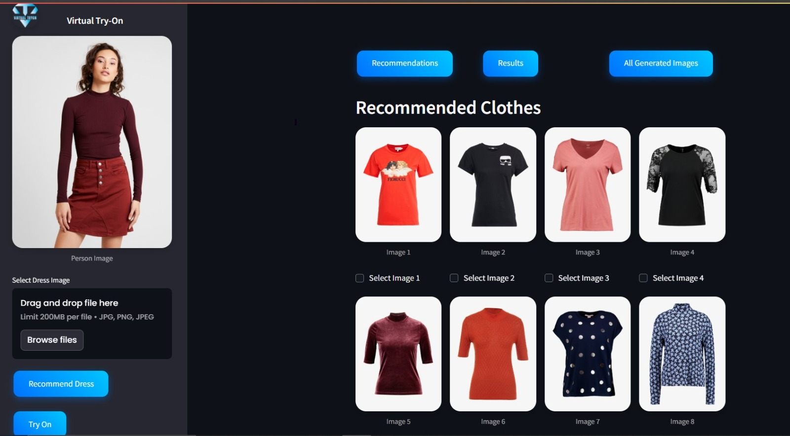
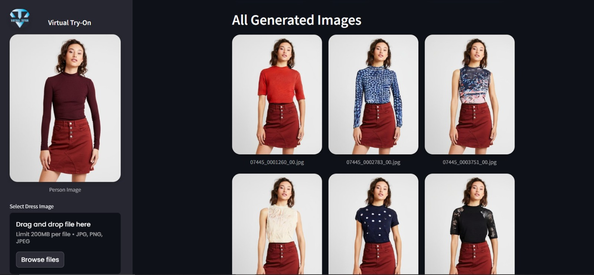
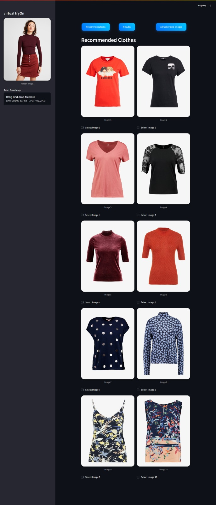
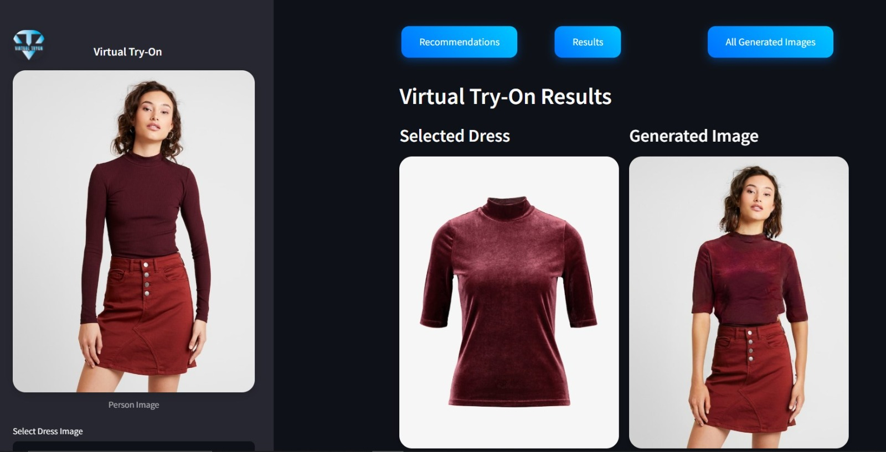

# Virtual Try-On Outfit Assistant

##  Abstract

The Virtual Try-On Outfit Assistant is an AI-powered system that enhances online fashion experiences by allowing users to upload images, receive intelligent clothing recommendations, and visualize outfits virtually. Built using deep learning models and a responsive Streamlit interface, this project combines computer vision with personalized fashion technology.


## Project Description
This project is a Virtual Try-On system that allows users to upload dress images, receive clothing recommendations, and virtually try on selected clothes. It features a user-friendly Streamlit interface with functionalities including dress recommendation, virtual try-on image generation, trending outfit tracking, and viewing all generated images.

## Features
- Upload a dress image to get clothing recommendations based on visual similarity.
- Select recommended clothes and generate virtual try-on images.
- View virtual try-on results side-by-side with selected clothes.
- Explore all generated images in a dedicated tab.
- Track and display trending outfits based on user interactions (likes, clicks, ratings).
- Trending shirts section with selection and try-on capabilities.
- Custom styled Streamlit interface for an enhanced user experience.

##  Technologies Used

- **Frontend**: Streamlit  
- **Backend**: Python  
- **Machine Learning**: PyTorch, TensorFlow, Keras, Scikit-learn  
- **Computer Vision**: OpenCV, ResNet50  
- **Others**: Matplotlib, NumPy, JSON  

##  How It Works

1. **User uploads a clothing image**
2. **Feature extraction** using ResNet50
3. **Recommendation engine** finds similar clothes
4. **User selects clothes** for virtual try-on
5. **Try-on system** uses deep learning models to generate results
6. **Results and trends** are displayed on the UI

## Installation

### Prerequisites
- Python 3.7 or higher
- pip package manager

### Dependencies
Install required Python packages using:

```bash
pip install -r requirements.txt
```

The main dependencies include:
- torch
- numpy
- matplotlib
- streamlit
- keras
- scikit-learn
- tensorflow
- opencv-python

## Usage

1. Run the Streamlit app:

```bash
streamlit run app.py
```

2. Upload a dress image in the sidebar under "Select Dress Image".
3. Click "Recommend Dress" to generate clothing recommendations.
4. In the "Recommendations" tab, select one or more recommended clothes.
5. Click "Try On" to generate virtual try-on images.
6. View the results in the "Results" tab.
7. Explore all generated images in the "All Generated Images" tab.
8. Check trending outfits in the "Trending Shirts" tab and try them on.

## System Overview

### Recommendation System
- Uses a pretrained ResNet50 model (ImageNet weights) with GlobalMaxPooling2D for feature extraction.
- Extracts features from the uploaded dress image.
- Finds top 10 visually similar clothes using nearest neighbor search (Euclidean distance).
- Recommended clothes are displayed with checkboxes for selection.

### Virtual Try-On System
- Utilizes three deep learning models:
  - Segmentation Generator (SegGenerator) for human parsing.
  - Geometric Matching Module (GMM) for clothes deformation.
  - ALIAS Generator for try-on synthesis.
- Models are loaded from checkpoints in the `checkpoints/` directory.
- The pipeline includes segmentation generation, clothes deformation, and try-on synthesis.
- Generated images are saved in the `results/` directory.

### Trending System
- Tracks user interactions (likes, clicks, ratings) on outfits.
- Stores trending data in `trending/trending_data.json`.
- Scores outfits based on weighted sum of likes, clicks, and average ratings.
- Displays top trending outfits dynamically in the app.

## File Structure

```
Final_Year_Project-Outfit_Virtual_Assistant/
├── app.py                      # Main Streamlit app
├── featurize_cloth.py          # Recommendation logic
├── featurize_utils.py          # Feature extraction utilities
├── utils.py                    # Virtual try-on pipeline and utilities
├── load_network_setup.py       # Model loading for virtual try-on
├── networks.py                 # Model architectures
├── datasets.py                 # Dataset handling
├── recommender-system/         # Feature extraction data and scripts
│   └── extracted_features_with_paths.pkl
├── trending/                   # Trending system modules and data
│   ├── models.py
│   ├── score.py
│   ├── tracker.py
│   └── trending_data.json
├── checkpoints/                # Model checkpoints for virtual try-on
├── results/                   # Generated virtual try-on images
│   └── test/
├── logo/                      # Project logo assets
│   └── logo.png
├── requirements.txt           # Python dependencies
├── recommend_clothes.txt      # Recommended clothes list
├── selected_clothes.txt       # Selected clothes list
└── uploaded_image.jpg         # Uploaded dress image
```
## Dataset

For testing purposes, two dataset options are available:

- **Zalando-HD Resized Dataset:**  
  You can download the high-quality fashion images resized for easier processing here:  
  Zalando-HD Resized Dataset (Visit here: https://www.kaggle.com/datasets/tinkukalluri/zalando-hd-resized)

## Screenshots

### Full Interface


### Generated Images


### Recommended Clothes


### Virtual Try-On Results


## Future Improvements

- **Full-Body Try-On Support:**  
  Extend the system to support full-body outfits (e.g., pants, skirts, full dresses) for a more complete virtual try-on experience

- **Multi-language Support:**  
  Localize the app in multiple languages to improve accessibility for a global audience.

## Credits
- Deep learning models and virtual try-on pipeline adapted from research implementations.
- Streamlit for the interactive web interface.
- Pretrained ResNet50 model for feature extraction.
- Open source libraries: PyTorch, TensorFlow, Keras, OpenCV, scikit-learn.

---

##  Authors

This Final Year Project was developed as part of the Bachelor's degree program in **Computer Software Engineering** at **UET Mardan, Khyber Pakhtunkhwa, Pakistan**.

| Name              | Department                         | Institution                        |
|-------------------|------------------------------------|-------------------------------------|
| Muhammad Shakeel  | Department of Computer Software Engineering | UET Mardan, KPK, Pakistan     |
| Sikandar Afridi   | Department of Computer Software Engineering | UET Mardan, KPK, Pakistan     |
| Yasir Akbar       | Department of Computer Software Engineering | UET Mardan, KPK, Pakistan     |

##  License

This project is licensed under the [MIT License](LICENSE) – feel free to use, modify, and share with attribution.

